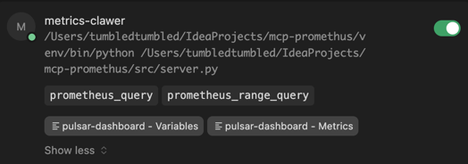
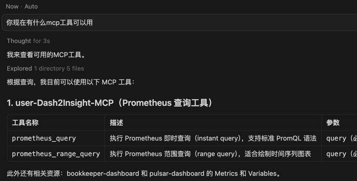

[English](README.md) | 中文

# Dash2Insight-MCP

一个 MCP (Model Context Protocol) 服务器， 从已有的Grafana Dashboard提取专业的监控指标信息，
并通过 Prometheus 查询实时数据，辅助 AI 进行监控分析和故障排查。

重要特性包括：
- 支持从大型 JSON（20000+ 行）中提取关键指标信息，节省 AI context，关注重要指标。
- 支持 Prometheus 即时查询和范围查询，满足不同监控需求。
- 支持 Dashboard 变量解析，动态获取监控指标和选项。

## 环境要求

- **Python**: 3.10+ （MCP SDK 最低要求）
> ⚠️ **注意**: MCP Python SDK 要求 Python 3.10 或更高版本

### 配置环境方法一：使用自动化脚本（推荐）

```bash
./setup.sh
```

此脚本会自动：
- 检测可用的 Python 3.10+ 版本
- 创建虚拟环境
- 安装所有依赖
- 运行基础测试

### 配置环境方法二：手动安装

#### 1. 检查 Python 版本

```bash
python3 --version
# 确保版本 >= 3.10
```

如果版本过低，请安装 Python 3.10+：
- macOS: `brew install python@3.10` 或 `brew install python@3.11`
- Linux: 使用系统包管理器安装
- Windows: 从 [python.org](https://www.python.org/downloads/) 下载

#### 2. 创建虚拟环境

```bash
# 使用 Python 3.10+ 创建虚拟环境
python -m venv venv

# 激活虚拟环境
# macOS/Linux:
source venv/bin/activate
# Windows:
# venv\Scripts\activate
```

#### 3. 安装依赖

```bash
# 升级 pip（推荐）
pip install --upgrade pip

# 安装项目依赖
pip install -r requirements.txt
```


## 运行服务

### 1. 添加 Dashboard 文件
从grafana导出的 dashboard json 文件，放到 `dashboard/` 目录下，可放置多个 dashboard 文件。
> ⚠️ **注意**: 一个专业的Grafana dashboard元数据对于AI分析非常重要。

具体方法：
1. 打开 Grafana 仪表盘
2. 点击右上角的齿轮图标（设置）
3. 选择 "JSON Model"
4. 复制内容并保存为 `your-service-dashboard.json` 文件。

### 2. 配置 Prometheus

复制示例配置文件并编辑：

```bash
cp config.yaml.example config.yaml
```

然后编辑 `config.yaml`，填入你的 Prometheus 服务器信息和 Dashboard 列表：

```yaml
prometheus:
  url: "http://your-prometheus-url:9090"
  username: "your_username"  # 可选，如果需要认证
  password: "your_password"  # 可选，如果需要认证
  timeout: 30

dashboards:
  - name: "pulsar-dashboard"
    path: "./dashboard/pulsar-dashboard.json"
```

> ⚠️ **注意**: `config.yaml` 包含敏感信息，已被 `.gitignore` 忽略，不会被提交到仓库。

**指定配置文件路径**：可使用项目外的配置文件：
- **命令行**：`python -m src.server -c /path/to/config.yaml` 或 `./scripts/run_server.sh --config /path/to/config.yaml`
- **环境变量**：设置 `DASH2INSIGHT_CONFIG=/path/to/config.yaml`（在 MCP 客户端不传参时可用）

### 3. 配置 MCP Server

在Cursor、Claude Desktop 等AI客户端中，配置 MCP Server，指向 `server.py` 脚本。
下面以Cursor为例，说明如何配置 MCP Server：
1. 打开 Cursor Settings
2. 找到 "MCP Servers" 配置
3. 添加服务器配置

**方案 1: 使用虚拟环境 Python**

```json
{
  "mcpServers": {
    "Dash2Insight-MCP": {
      "command": "/path/to/Dash2Insight-MCP/venv/bin/python",
      "args": ["/path/to/Dash2Insight-MCP/src/server.py"],
      "cwd": "/path/to/Dash2Insight-MCP"
    }
  }
}
```
> 尽量使用绝对路径，避免环境变量问题。 \
> 若使用项目外的配置文件，在 `args` 中增加 `"-c", "/path/to/your/config.yaml"`。 \
> ⚠️ **方案 1 须设置 `cwd`** 为项目根目录，否则会报错：`ModuleNotFoundError: No module named 'src'`。


**方案 2: 使用启动脚本**

脚本会自动切换到项目根目录，无需在 MCP 配置里设置 `cwd`：

```json
{
  "mcpServers": {
    "Dash2Insight-MCP": {
      "command": "/path/to/Dash2Insight-MCP/scripts/run_server.sh"
    }
  }
}
```

4. 重启 Cursor

配置完成后，**重启 Cursor**，使 MCP 服务器生效，AI 即可使用 prometheus_query、prometheus_range_query 工具，以及访问 dashboard variables 和 metrics 资源。
成功截图如下：




## 使用例子

1. 给我生成一份pulsar集群的流量报告，用markdown文档存储。
2. XXX集群在XXX时发生故障，帮我分析一下故障原因，给出排查思路。
3. 分析XXX集群的负载情况，给出优化建议。
